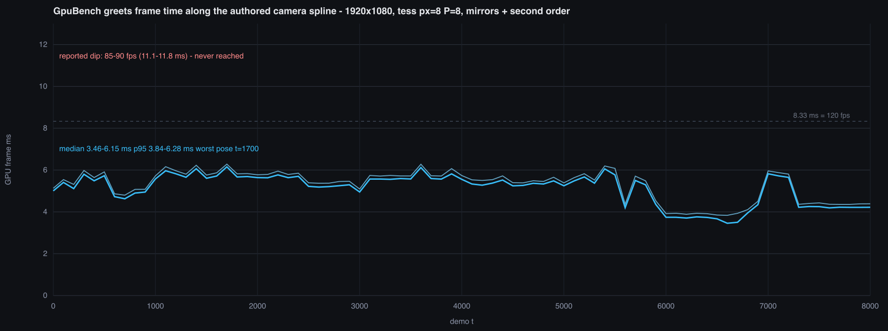

# GpuBench greets frame-time sweep — chasing the reported 85–90 fps dips

Question asked: the GPU window occasionally drops to **85–90 fps (11.1–11.8 ms/frame)**.
Is that GPU pass cost, or something in the window loop?

**Answer: not reproducible offscreen.** Across the whole greets timeline the GPU
passes never exceed **6.3 ms**, and offscreen wall-clock per frame (CPU encode +
GPU) never exceeds **7.5 ms**. The missing ~4 ms is in the window path, which an
offscreen render cannot exercise by construction.



## Method

```
cd Runtime
../build-gpu/GpuBench/GpuBench --fld=SCENES/GREETS.FLD --t=<T> --pass=deferred \
  --warmup=30 --iters=250 --tess --tess_px=8 --tess_presplit=8 \
  --spline --reanimate --no-draw
```

81 poses, `t = 0 … 8000` step 100 — the full part. 1920×1080 (matching
`Runtime/rev.cfg`), the user's feature set: hardware tessellation at px=8 P=8,
mirrors on, **second-order mirrors on**, `--reanimate` so the window's own
per-frame refresh path runs. Raw data: `data/greets_frame_time_spline_sweep.csv`.

**`--spline` is load-bearing and was missed on the first two attempts.** Without
it the default `camPose` (the t=5743 review pose) PINS the camera and `--t` only
drives animation, so a "t-sweep" measures one camera with a moving mech. Those
runs looked flat at 5.0–6.7 ms for the wrong reason. Every number below is from
the spline arm.

## Result

| statistic | min | median | max |
|---|---|---|---|
| frame total, median of 250 | 3.46 | 5.37 | **6.15** |
| frame total, p95 of 250 | 3.84 | 5.53 | **6.28** |

Poses over 8 ms: **0**. Over 10 ms: **0**. Over 11 ms: **0**.

Worst poses by p95 (per-pass columns are each pass's own p95, ms):

| t | median | p95 | shadow | gbuffer | lighting | tonemap | mirror | mirror2 | tess-fac |
|---|---|---|---|---|---|---|---|---|---|
| 1700 | 6.15 | 6.28 | 0.54 | 1.78 | 2.60 | 4.00 | 2.54 | 2.66 | 0.028 |
| 3600 | 6.12 | 6.28 | 0.55 | 2.65 | 3.32 | 4.04 | 3.29 | 2.77 | 0.018 |
| 1400 | 6.06 | 6.23 | 0.55 | 1.81 | 2.62 | 3.92 | 2.54 | 2.65 | 0.028 |
| 5400 | 6.06 | 6.19 | 0.55 | 2.42 | 3.08 | 3.97 | 2.62 | 2.12 | 0.018 |
| 1100 | 5.96 | 6.16 | 0.56 | 2.11 | 2.85 | 3.73 | 2.81 | 2.91 | 0.032 |

**The per-pass columns do not sum to the frame total and must not be read that
way.** This device only supports `MTLCounterSamplingPointAtStageBoundary`, so
each number is an encoder's start-to-end span on the GPU timeline, and those
spans overlap heavily. The frame total is the only additive figure.

## Where the missing milliseconds are

Wall-clock differencing at the two worst poses — same process, same flags, only
`--iters` changed, so the difference is 1000 frames of the offscreen loop
including all CPU-side encode:

| pose | iters=200 | iters=1200 | per frame | GPU-only median |
|---|---|---|---|---|
| t=1700 | 3.184 s | 10.723 s | **7.54 ms** | 6.15 ms |
| t=3600 | 3.076 s | 10.358 s | **7.28 ms** | 6.12 ms |

So CPU-side encode + submit costs ~1.2–1.4 ms/frame on top of the GPU, and the
whole offscreen pipeline runs at **133–137 fps** at its worst pose.

- **MEASURED**: GPU passes ≤ 6.3 ms at every pose; offscreen wall ≤ 7.5 ms.
- **MEASURED**: second-order mirrors cost +0.11 ms (they are not the dip).
- **INFERRED**: 85–90 fps needs 11.1–11.8 ms. At least ~3.6–4.3 ms/frame is
  therefore spent in work the offscreen path does not do — drawable acquisition
  and present, the HUD, and any window-only per-frame work. Note that a missed
  vsync on a 120 Hz display lands at 60 fps, not 85–90, so a plain
  frame-doubling stall does not explain the number either; 85–90 fps looks like
  either a free-running present with ~11.5 ms of real per-frame work, or a
  variable-refresh display tracking it.

## What to do next, in the window

The window HUD already prints per-pass GPU ms plus `CPU ANIM` / `UPLOAD`. Its
pass-name array used to have five entries while the loop ran over six passes —
an out-of-bounds read that printed a garbage label on the last row; that is
fixed, and the array is now `kPasses`-sized (seven, including `MIRROR2`).

When the dip happens, the HUD settles it in one glance:

- **`GPU FRAME` rises toward 11 ms** → it is GPU pass cost after all, at a pose
  this sweep did not sample (a free-fly pose off the authored spline).
- **`GPU FRAME` stays ~6 ms while FPS reads 85–90** → the GPU is idle and the
  cost is present/vsync or CPU-side; `CPU ANIM` and `UPLOAD` say which.
